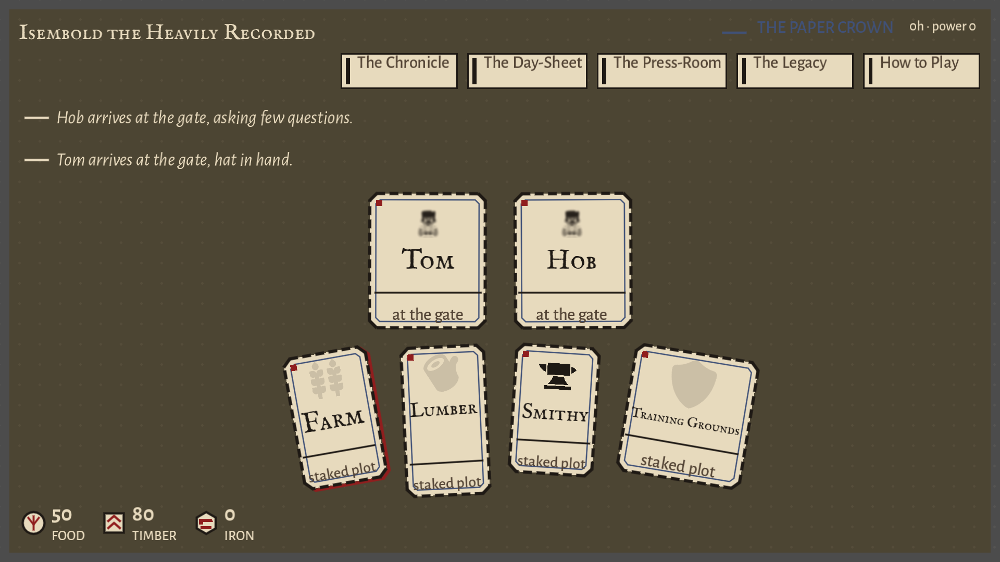
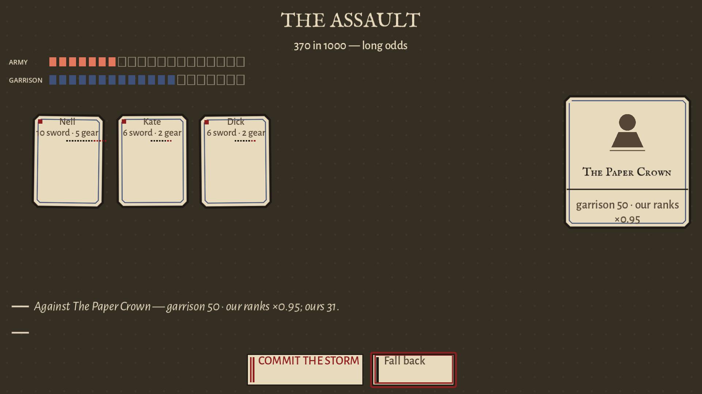
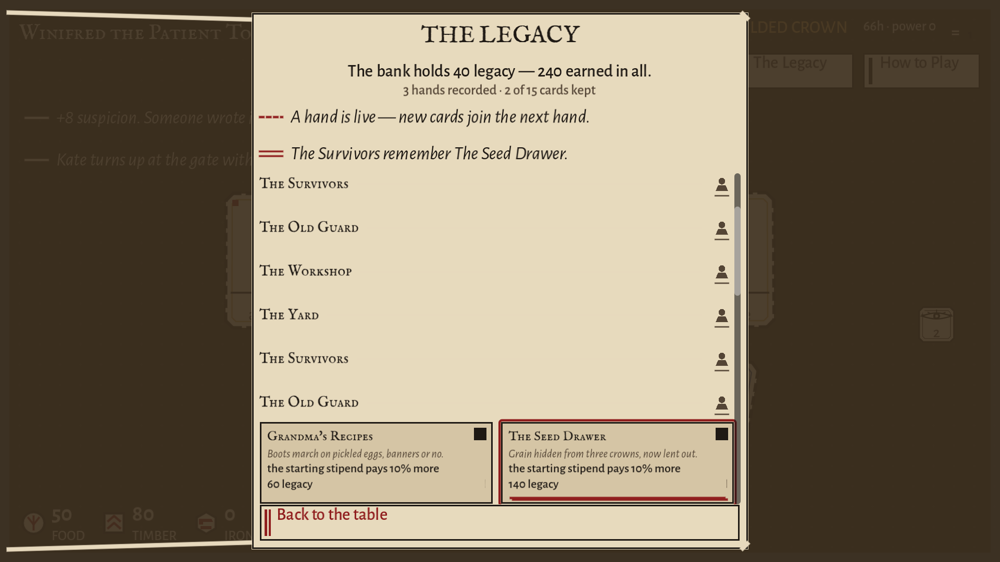

# Castle Storm

**Build a rebellion. Storm the castle. Face the army you left behind.**

Castle Storm is a satirical idle army-builder with a roguelite reset loop. Begin as one peasant, recruit followers, grow an economy, and prepare an assault. Every ended run becomes part of the chronicle. A victory changes the next regime: your own winning veterans become the defenders of the castle you will challenge again.

The game unfolds on **The Conspiracy’s Spread**, an ink-on-paper table of people, resources, orders, and consequences.



*The table brings the army, economy, and regime into one printable-card world.*

[Get started](#run-from-source) · [Controls](#controls) · [Balance notes](docs/balance.md) · [Developer setup](docs/DEV_SETUP.md)

## The rebellion loop

| Step | What you decide |
|---|---|
| **Recruit** | Turn a lone peasant’s stipend into a growing band of followers |
| **Assign** | Put workers into food, timber, and iron production |
| **Prepare** | Develop buildings, train units, and equip the army |
| **Manage suspicion** | Grow without letting the Watchful Eye end the rebellion early |
| **Storm** | Read the assault odds and commit when you are ready |
| **Bank and return** | Keep earned legacy progress, record the hand, and begin another hand |

The current game includes four upgradeable buildings, melee and archer training paths, two equipment slots across three gear tiers, and four regime flavors. It is deliberately an idle game: important training and economic steps take real time. The balance documentation describes a multi-day first campaign, rather than a short action-game session.

Time away is resolved when you return, with an **eight-hour offline-progress cap** and a report of what happened.

## Growth attracts attention

Recruiting and expansion draw the **Watchful Eye**. Suspicion telegraphs consequences before crackdowns seize resources or disrupt the camp; a crush can end a run. The economy and the regime are part of the same decision, so building more quickly is not always the safest plan.

When you choose to storm, combat is automatically resolved. The assault screen exposes the odds before commitment, then plays the result through a card-based vignette. A failed assault costs soldiers and raises suspicion, but normally leaves the run active so you can rebuild. If that suspicion reaches its maximum, the rebellion can be crushed.



*A seeded demonstration at 22 simulated hours shows 370/1000 assault odds. Review the army and visible odds before sending it in.*

## Your last victory becomes the next obstacle

A win stores the winning army as the next castle’s garrison, including its units and equipment tiers. The first captured cycle uses a **1.00×** escalation multiplier; subsequent cycles compound that multiplier by **1.10×**. The next opening and odds display tell you whose veterans hold the walls. Defeat and abandonment preserve the current regime; a victory draws the regime for the next hand.

Between hands, **The Legacy** turns banked progress into permanent advantages. Its 15 cards span four families:

| Family | Direction |
|---|---|
| **The Old Guard** | A stronger opening stipend |
| **The Workshop** | Lower building and equipment costs |
| **The Yard** | Faster training |
| **The Survivors** | Less suspicion and stronger veteran fighters |



*A review fixture with three ended hands: 240 points earned, 200 spent, and two of 15 cards purchased. Effects join the next hand.*

Wins, losses, and abandoned runs can bank legacy points. Losing a run does not remove points already banked or cards already purchased. The title screen and table header provide access to the Legacy deck; the chronicle preserves the history of ended hands.

## Run from source

Use the standard **Godot 4.7.2-stable** GDScript build with the Compatibility renderer. The project targets desktop systems; physical Steam Deck validation remains a separate item on the roadmap.

```sh
git clone https://github.com/Arrangedgodly/castle-storm.git
cd castle-storm
```

### Godot editor

Import `project.godot`, allow the asset import to finish, and press **F5** to run the configured main scene. This opens the actual title/continue/new-run flow.

### Make workflow

The Makefile defaults to `tools/godot/godot`, a gitignored engine binary. If your engine is installed elsewhere, specify it explicitly:

```sh
make GODOT_BIN=/path/to/godot version
make GODOT_BIN=/path/to/godot import
make GODOT_BIN=/path/to/godot run-game
```

Use the appropriate executable path for your system. GNU Make and a suitable shell are needed for this command-line workflow; the editor route avoids relying on those tools simply to play.

| Command | Purpose |
|---|---|
| `make version` | Print the configured engine version |
| `make import` | Import project assets |
| `make run-game` | Open the real game |
| `make check` | Perform the headless project-load check |
| `make test` | Run the project’s test and acceptance battery |
| `make run-demo` | Run the seeded developer demonstration |

Add `GODOT_BIN=/path/to/godot` to these commands when using a non-default engine location. **`run-demo` is an automated developer demonstration, not the normal player entry point.** Its acceleration and pause controls are debug-only, gated by `CS_DEBUG_CHROME=1`.

## Controls

| Action | Keyboard / mouse | Gamepad |
|---|---|---|
| Activate the focused card or control | Enter, Space, or left click | A |
| Back / fold | Escape | B |
| Navigate focus | Arrow keys | D-pad / sticks |

The interface also provides touch input, but this repository does not yet ship a mobile build. The in-game press-room includes a **1.0–1.3× type-scale setting**. State uses different line forms as well as color.

A saved run offers **CONTINUE** or **NEW RUN**. Starting over uses a confirmation step because it ends the current hand and records that outcome. Do not use debug acceleration when assessing the intended player pacing.

## Systems and project structure

| Path | Responsibility |
|---|---|
| `ui/` | Table, assault, chronicle, leader introduction, and print-themed components |
| `sim/` | Headless-first deterministic economy and simulation |
| `content/` | Units, buildings, gear, regimes, and balance data |
| `sim/save_manager.gd`, `sim/run_meta.gd` | Versioned run/meta saves and atomic-write handling |
| `tests/` | Unit, property, and acceptance coverage |
| `addons/gdUnit4/` | Vendored test framework |
| `scripts/` | CI, exports, balance, and performance tools |
| `assets/vendor/` | Third-party art and fonts with attribution |

Normal play stores data under Godot’s `user://saves` location, not in the repository’s `saves/` placeholder.

The separation between simulation and presentation allows long campaigns, save behavior, and replay invariants to be exercised without opening the game window. The suites cover the economy-to-assault loop, banking and restarting, escalating garrisons, corruption cases, and input paths. See [the acceptance sweep](docs/acceptance-sweep.md) for the recorded criteria and evidence; use current test output for current pass counts.

## Export desktop builds

The export workflow requires the matching Godot templates and platform tooling:

```sh
scripts/fetch_templates.sh
make export
```

Read [DEV_SETUP.md](docs/DEV_SETUP.md) before installing templates or exporting. The configured targets are Windows, macOS, and Linux, with outputs under `exports/`. macOS DMGs must be produced on a Mac. Building an export is separate from running the source project, and the README does not imply that a prebuilt release is available.

## Current limits

- The Steam Deck window profile has been exercised, but validation on actual Deck hardware remains pending.
- Normal-time training is slow by design; the first trainee transition is documented at roughly 2 hours 20 minutes.
- Long names can clip inside cards in the narrowest dense roster layout.
- Audio is not implemented yet; event hooks exist without shipped audio assets.
- The current interface is English-only, with no mobile releases.

The screenshots use the committed demonstration/capture paths and illustrative game states. They show the game’s renderer rather than a record of an ordinary-speed player campaign.

## License and credits

Project code and original content are [MIT-licensed](LICENSE). Bundled third-party assets keep their own terms: Kenney packs are CC0, game-icons.net work includes CC BY 3.0 attribution requirements, and fonts use SIL OFL notices. Preserve [the asset attributions](assets/vendor/ATTRIBUTIONS.md) when redistributing.

## Further reading

- [Product brief](PRODUCT.md) and [visual design](DESIGN.md)
- [Balance and escalation](docs/balance.md)
- [Input parity](docs/input-parity.md)
- [Save architecture](docs/save-format.md)
- [Steam Deck validation checklist](docs/deck-validation.md)
